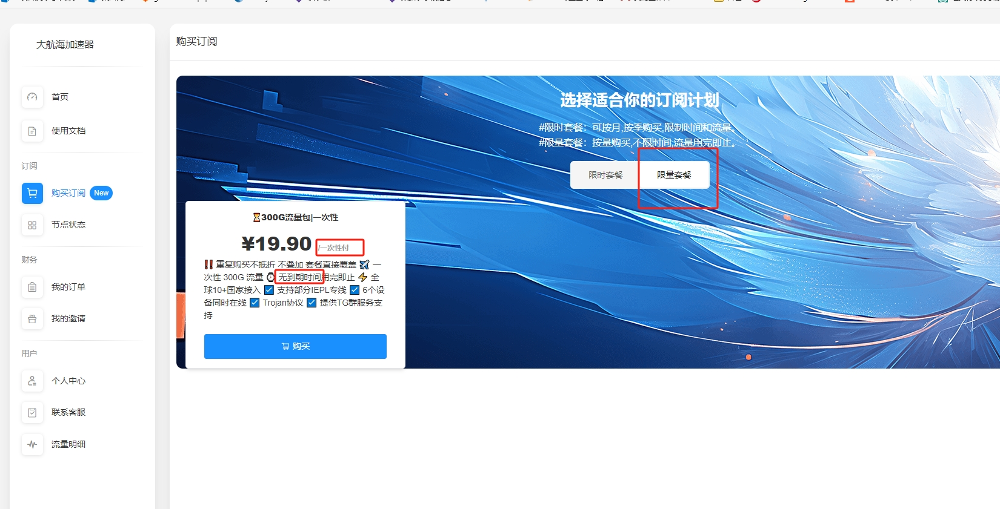
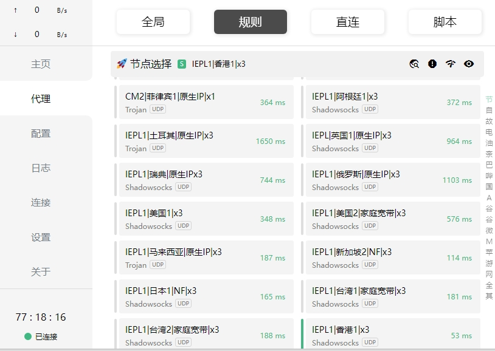
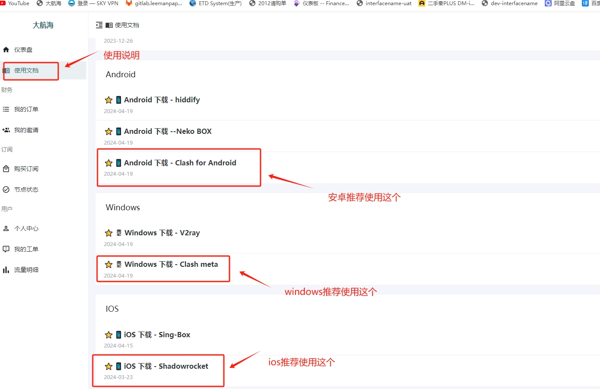
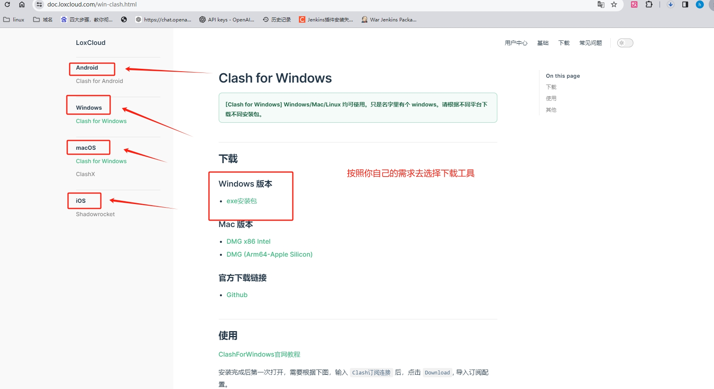
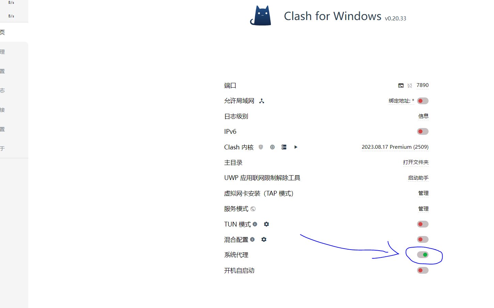
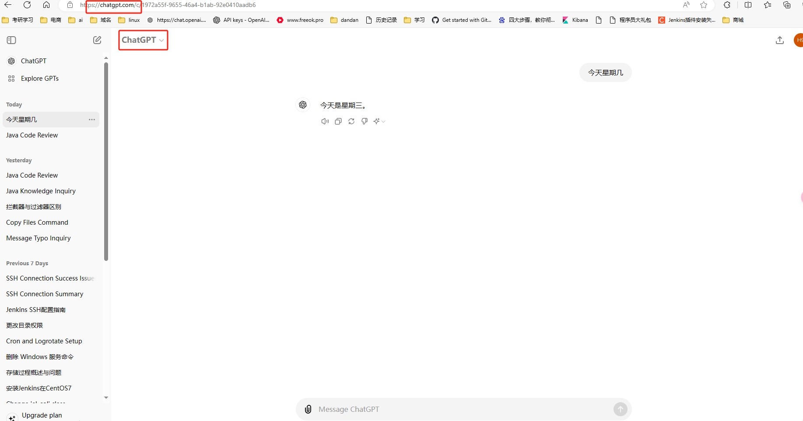

# VPN
推荐最好用的VPN,年费19.9元(人民币),月费8.8元,推荐用年费，【知乎推荐排行】，300G流量根本用不完，速度快，可以考研学习使用，看TikTok，YouTuBe等！Tiktok的使用，安装方法！

## VPN链接：https://www.dhh.homes/#/login?code=LhGw83Lu

2024年最适合中国大陆用户的科学上网机场节点VPN推荐，包含稳定机场、老牌机场、高端机场、翻墙梯子、流媒体解锁机场等等。科学上网的便宜梯子加速器适合已经熟悉 SS/SSR/V2ray/Trojan 等翻墙网络协议，掌握了手机pc电脑挂梯子基础知识的外贸、编程、学生等上外网梯子需求人员。如果你还没有听过说节点网络加速器，不知道机场节点和VPN梯子的区别。请点击这里了解。机场不同于一键VPN，在速度和稳定表现十分优异，加上高性价比的便宜价格，是目前主流的魔法上网方法。

## 地址演示

  

## 速度演示

  

## 软件推荐

  

windows的工具：https://doc.loxcloud.com/win-clash.html

  

  

可以使用GPT

  

## 下载安卓tiktok软件

安卓tiktok链接：https://xiguajiasu.shop/anzhuo/TikTok.apk

安卓tiktok备用链接：https://xiguajiasu.shop/anzhuo/TikTok1.apk

## 使用范围
tiktok只能观看，不能发布作品，发布作品需要独立，住宅ip，（亚马逊，tiktok运营才需要，个人可以自己弄一个月20左右人民币，可以试用一天再下单）
##  Chargpt账号也有，账号密码由你自己定，我帮你创建，一个号6RNB,合法合理的用户做学习
